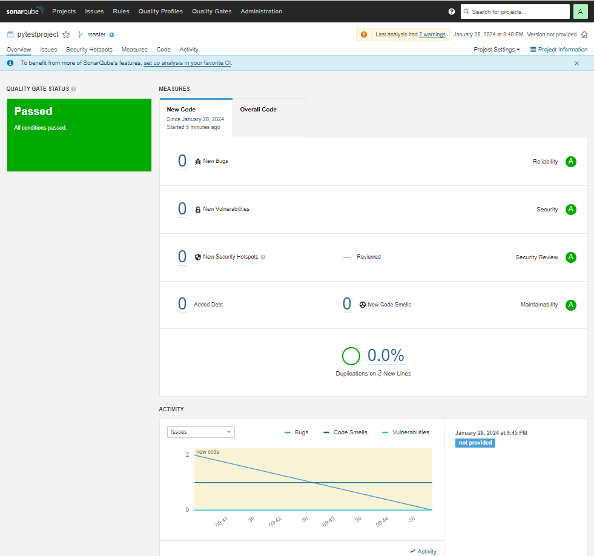
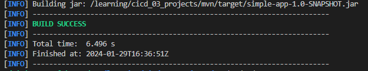
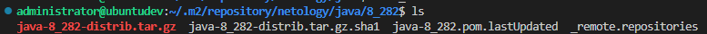

# 1. Знакомоство с SonarQube

1. Сервер sonarqube развернут на внутренней виртуальной машине под управлением ОС  Ubuntu 22.04. IP-адрес машины 192.168.10.233
2. Анализ кода в файле **./example/fail.py** проводился командой:
sonar-scanner  -Dsonar.login=user1 -Dsonar.password=user1 -Dsonar.coverage.exclusions=fail.py
где:
- ключ **-D** означает **определить свойство** после чего идет имя свойства и через равно идет его значение
- подключение осуществляется по логину и паролю указанных в свойствах **sonar.login** и **sonar.password**
- в свойстве **sonar.coverage.exclusions** указывается какие файлы не тестируются

3. Результат двух выполнений команды приведен на рисунке ниже:


# 2. Знакомство с Nexus

1. Через кнопку **Browse** можно открыть преднастроенное хранилище в Nexus
2. Через кнопку **Upload** можно загрузить артифакт в любое преднастроенное хранилище Nexus
3. После загрузки всех версий артифакта netology файл maven-metadata.xml можно скачать по кнопке **Browse** перейдя в соответствующее хранилище.

```
<metadata modelVersion="1.1.0">
<groupId>netology</groupId>
<artifactId>java</artifactId>
<versioning>
<latest>8_282</latest>
<release>8_282</release>
<versions>
<version>8_102</version>
<version>8_282</version>
</versions>
<lastUpdated>20240128192627</lastUpdated>
</versioning>
</metadata>
```
# 3. Знакомство с Maven
1. Необходимо создать **pom.xml** файл. Скорректированный файл имеет следующее содержимое:
```
<project xmlns="http://maven.apache.org/POM/4.0.0" xmlns:xsi="http://www.w3.org/2001/XMLSchema-instance"
  xsi:schemaLocation="http://maven.apache.org/POM/4.0.0 http://maven.apache.org/xsd/maven-4.0.0.xsd">
  <modelVersion>4.0.0</modelVersion>
 
  <groupId>com.netology.app</groupId>
  <artifactId>simple-app</artifactId>
  <version>1.0-SNAPSHOT</version>
   <repositories>
    <repository>
      <id>my-repo</id>
      <name>maven-public</name>
      <url>http://192.168.10.234:8081/repository/maven-public/</url>
    </repository>
  </repositories>
  <dependencies>
     <dependency>
      <groupId>netology</groupId>
      <artifactId>java</artifactId>
      <version>8_282</version>
      <classifier>distrib</classifier>
      <type>tar.gz</type>
    </dependency>  
  </dependencies>
</project>
```
2. Для сборки пакетов в Nexus используется maven. Для этого из папки с pom-файлом запускаем команду:
**mvn package**
3. Результат выполнения команды приведен на рисунке:


4. В итоге был создан и развернут пакет maven:



